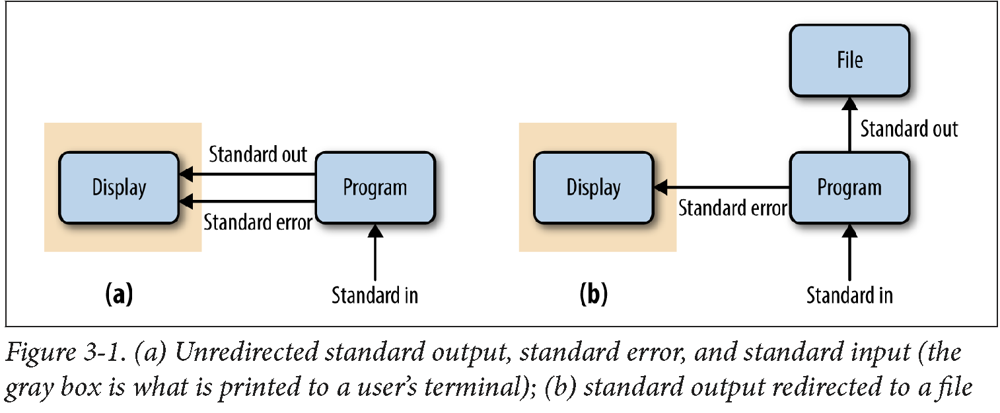
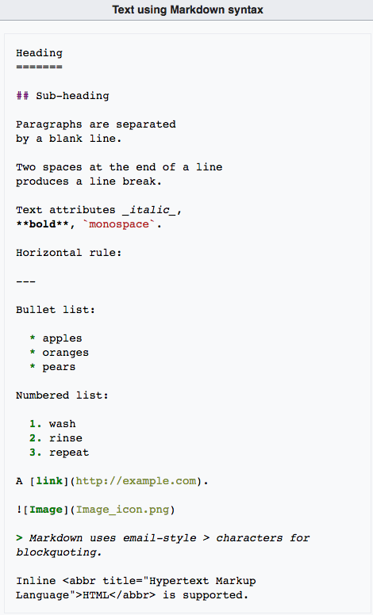
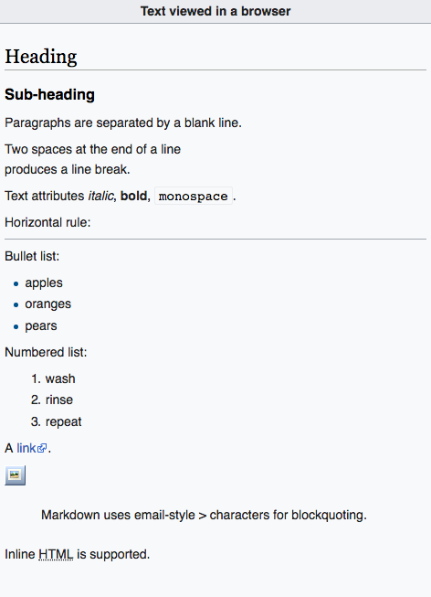

```{r, include=FALSE}
source("../bin/chunk-options.R")
knitr_fig_path("01-")
# good alternative: http://tryr.codeschool.com/
```


# UNIX 

The objective of this tutorial is to introduce you to the Unix Shell. Although UNIX's  Command-Line Interface 
may seem archaic, it is the single most powerful tool in a bioinformaticians toolbox. Some basic understanding 
of how to use the Command Line to move, modify and view files containing molecular and descriptive data is an 
absolute requirement for modern biological analysis.

## A few definitions:
**UNIX** A computer operating system originally developed in 1969 by a group of AT&T employees at Bell Labs. Unix was designed to be portable, multi-tasking and multi-user in a time-sharing configuration. Unix systems are characterized by various concepts: the use of plain text for storing data; a hierarchical file system; treating devices and certain types of inter-process communication (IPC) as files; and the use of a large number of software tools, small programs that can be strung together through a command line interpreter using pipes, as opposed to using a single monolithic program that includes all of the same functionality. These concepts are known as the Unix philosophy.

**Terminal**  A device, including a keyboard and a screen (or printer), used to send data to and receive data from a computer.

**Terminal.app** is a terminal emulator included with your operating system. It allows the user to interact with the computer through a command line interface. On Mac OS X, Terminal is located in the /Applications/Utilities folder. You can personalize the appearance of the terminal window using the Terminal -> Preferences menu option.

**Shell**  A program that allows the system (UNIX) to understand your commands. There are three main uses for the shell: interactive use (reading input from your terminal and sending output to it); customization of your UNIX session; programming. Several shells are available in UNIX. We will be using the Bourne again shell (bash).

## Unix basics:

Before we do anything in unix we need to know these ten essential Unix commands for navigation and file manipulation:

```{bash, eval=FALSE}
pwd, ls, cd, cp, mv, mkdir, rm, man, cat/zcat, echo #separated by ,
```

You should also be familiar with the meaning of the following wildcards and shell expansion characters:

```{bash, eval=FALSE}
*, ?, [A-Z], /, ./, ../, ~ #separated by , 
```

Finally, you need to know the difference between the absolute and relative path, e.g.,

```{bash, eval=FALSE}
cd /usr/local/bin
cd ../lib
```

To make sure that we are all on the same page, predict the action of the following commands and check your 
predictions by typing them in the terminal:

```{bash, eval=FALSE}
cd;
pwd;
ls -tl;
mkdir -p test-dir/lab1;
cd test-dir/lab1;
mkdir temp1 temp2 temp3;
mv temp1 temp2 temp3;
rm -rf temp*;
cd ..;
cd -;
pwd;
```

> ## Tip: Shell Expansion
>
> As you start spending more time in a terminal, you'll start to collect tricks to make this process as 
> efficient as possible. One useful trick is shell expansion. Shell expansion is when your shell expands 
> text for you so you don’t have to type it out. As we just saw above, the shell expands the tilde character 
> (~) to the full path to your 
> home directory. A type of shell expansion called brace expansion can be used to quickly create the 
> simple directory structure with a single command. Brace expansion creates strings by expanding out 
> the comma-separated values inside the braces. This is easier to understand through a trivial example:
> ```{bash}
> echo dog-{gone,bowl,bark}
> ```
> Using the same strategy, we can create a project directory:
> `mkdir -p zmays-snps/{data/seqs,scripts,analysis}`
> Note that we need to use mkdir’s -p flag, which tells mkdir to create any necessary 
> subdirectories it needs (in our case, data/ to create data/seqs/).
>
{: .callout}

> ## Tip: autocompletion and history
> 
> There are two other extremely useful features provided by most shells: autocompletion and history. 
> 
> 1. If you hit the `tab` key after you started typing the name of a command or a file, the shell 
> will try to fill in the rest of it for you! If the beginning is ambiguous, it will show you available
> choices. For example, enter `c<tab><tab>` and you will see the name of every program you can run 
> that starts with an c. One of those is cat. Now, cat is easy to type, but there may be other 
> commands with longer names (e.g., fastx_nucleotide_distribution_graph.sh)!
>
> 2. Most shells will keep a history of recent commands! To access this history use your up and down errors. 
> The up arrow takes you backwards through your command history. The down arrow takes your forwards in the command history.
>
{: .callout}


## Working with Streams and Redirection
Bioinformatics data is often text-based and large. This is why Unix’s philosophy of handling text streams 
is useful in bioinformatics: text streams allow us to do processing on a stream of data rather than holding 
it all in memory. Handling and redirecting the streams of data is essential skill in Unix.

### Redirecting Standard Out to a File

By default, both standard error and standard output of most unix programs go to your terminal screen. 
We can change this behavior (redirect the streams to a file) by using `>` or `>>` operators. 
The operator `>` redirects standard output to a file and overwrites any existing contents of the file, 
whereas `>>` appends to the file. If there isn’t an existing file, both operators will create it before 
redirecting output to it. For example, to concatenate two FASTA files, we use `cat` command, but redirect 
the output to a file:

```{bash, eval=FALSE}
cat tb1-protein.fasta tga1-protein.fasta > zea-proteins.fasta
```

Note that nothing is printed to your terminal screen when you redirect standard output to a file 



How can we verify that the command worked?

### Redirecting Standard Error

Because many programs use the standard output stream for outputting data, a separate stream 
(standard error) is used for errors, warnings, and messages meant to be read by the user 
(depicted in Figure 3-1). Like standard output, standard error is by default directed to 
your terminal. Standard error stream can be redirected to a file with 2> to create
a log of messages, errors, and warnings that we can check later. If you want to redirect both
streams to the same file, use `command &> logfile` or `command &>> logfile`.

Redirection can be a useful way to silence diagnostic information some programs write to standard 
out: we just redirect to a logfile like stderr.txt. Unix-like operating systems also have a special 
“fake” disk (known as a pseudodevice) to redirect unwanted output to: /dev/null. Output written 
to /dev/null disappears, which is why it’s sometimes jokingly referred to as a “black‐hole”.

> ## Tip: `tail -f`
> 
> One way to write output to monitor redirected stanard output or error is to use
> `tail -f` with the output/error filename. 
>
{: .callout}

### Using Standard Input Redirection
Normally standard input comes from your keyboard, but with the `<` redirection operator 
you can read standard input from a file. Though standard input redirection is less common 
than >, >>, and 2>, it is still occasionally useful:

```{bash, eval=FALSE}
program < inputfile > outputfile
```

Many programs we’ll see later (like `grep`, `awk`, `sort`) can take a file argument in addition 
to input through standard input. Other programs (common especially in bioinformatics) use a single 
dash argument (-) to indicate that they should use standard input, but this is a convention rather 
than a feature of Unix.

## The Almighty Unix Pipe: Speed and Beauty in One
Unix pipes are similar to the redirect operators we saw earlier, except rather than redirecting a 
program’s standard output stream to a file, pipes redirect it to another program’s standard input. 
Only standard output is piped to the next command; standard error still is printed to your terminal 
screen.

Passing the output of one program directly into the input of another program with pipes is a computationally 
efficient and simple way to interface Unix programs. Pipes allow us to build larger, more complex tools 
from smaller modular parts. It doesn’t matter what language a program is written in, either; pipes will 
work between anything as long as both programs understand the data passed between them. As the lowest 
common denominator between most programs, plain-text streams are often used.

```{bash}
grep -v "^>" ../data/tb1.fasta | grep --color -i "[^ATCG]"
```

### Combining Pipes and Redirection

Obviously, we can combine pipes and redirections:

```{bash, eval=FALSE}
program1 input.txt 2> program1.stderr | program2 2> program2.stderr > results.txt
```

### Even More Redirection: A tee in Your Pipe

One advantage of using pipes is that we don't need to write/read intermediate files.
However, occasionally such files can be useful when debugging a pipeline or when you 
wish to store intermediate files for steps that take a long time to complete. The Unix 
program `tee` diverts a copy of your pipeline’s standard output stream to an intermediate 
file while still passing it through its standard output:

```{bash, eval=FALSE}
program1 input.txt | tee intermediate-file.txt | program2 > results.txt
```

## Managing and Interacting with Processes
When we run programs through the Unix shell, they become processes until they successfully 
finish or terminate with an error. There are multiple processes running on your machine 
simultaneously—for example, system processes, as well as your web browser, email application, 
bioinformatics programs, and so on. In bioinformatics, we often work with processes that run f
or a large amount of time, so it’s important we know how to work with and manage processes 
from the Unix shell.

### Background Processes
When we type a command in the shell and press Enter, we lose access to that shell prompt for 
however long the command takes to run (we say that the program is running in the foreground). 
We can tell the Unix shell to run a program in the background by appending an ampersand (&) 
to the end of our command. For example:

```{bash, eval=FALSE}
program1 input.txt > results.txt &
```

or by stopping a program with `Control-z` and sending it to background with `bg`.

When we send a program to background, the shell returns a number which is the process ID or PID 
of program1. This is a unique ID that allows you to identify and check the status of program1 
later on. We can check what processes we have running in the background with `jobs`:
To bring a background process into the foreground again, we can use `fg` (for foreground). `fg` 
will bring the most recent process to the foreground. To return a specific background job to the 
foreground, use `fg %<num>` where `<num>` is its number in the job list.

### Killing Processes
It’s not uncommon for a process to demand too many of our computer’s resources or become nonresponsive, 
requiring that we send a special signal to kill the process: `Control-c`. This only works if this process 
is running in the foreground. Killing a process ends it for good, and unlike suspending it with a stop 
signal, it’s unrecoverable. You can also kill a process with a `kill` command:

```{bash, eval=FALSE}
kill -9 <PID> # PID is process id
#or
kill -9 %<num> # %num is job number
```

### Exit Status: How to Programmatically Tell Whether Your Command Worked
One concern with long-running processes is that you’re probably not going to wait around to 
monitor them. How do you know when they complete? How do you know if they successfully finished 
without an error? Unix programs exit with an exit status, which indicates whether a program terminated 
without a problem or with an error. By Unix standards, an exit status of 0 indicates the process ran 
successfully, and any nonzero status indicates some sort of error has occurred (and hopefully the program 
prints an understandable error message, too). The exit status isn’t printed to the terminal, but your shell 
will set its value to a shell variable named `$?`. We can use the echo command to look at this variable’s 
value after running a command:

```{bash, eval=FALSE}
program1 input.txt > results.txt; echo $?
```

Exit statuses are useful because they allow us to programmatically chain commands together 
in the shell. A subsequent command in a chain is run conditionally on the last command’s exit status. 
The shell provides two operators that implement this: one operator that runs the subsequent command 
only if the first command completed successfully (&&), and one operator that runs the next command 
only if the first completed unsuccessfully (||).

For example, the sequence `program1 input.txt > intermediate-results.txt && program2 intermediate-results.txt > results.txt`
will execute the second command only if previous commands have completed with a nonzero exit status. 

By contrast, `program1 input.txt > intermediate-results.txt || echo "warning: an error occurred"` 
will print the message if error has occurred.

> ## Challenge 1
>
> To test your understanding of `&&` and `||`, we'll use two Unix commands that do nothing but return 
> either exit success (`true`) or exit failure (`false`). Predict and check the outcome of the following 
> commands:
> ```{bash, eval=FALSE}
> true
> echo $?
> false
> echo $?
> true && echo "first command was a success"
> true || echo "first command was not a success" 
> false || echo "first command was not a success"
> false && echo "first command was a success"
> ```
>
> > ## Solution to challenge 1
> >
> > ```{bash}
> > true
> > echo $?
> > false
> > echo $?
> > true && echo "first command was a success"
> > true || echo "first command was not a success" 
> > false || echo "first command was not a success"
> > false && echo "first command was a success"
> > ```
> {: .solution}
{: .challenge}


If f you don’t care about the exit status and you just wish to execute two commands sequentially, 
you can use a single semicolon (;):

```{bash}
false; true; false; echo "none of the previous mattered"
```

## Command Substitution
Unix users like to have the Unix shell do work for them—this is why shell expansions like wildcards 
and brace expansion exist. Another type of useful shell expansion is command substitution. Command 
substitution runs a Unix command inline and returns the output as a string that can be used in another 
command. This opens up a lot of useful possibilities. For example, if you want to include the results 
from executing a command into a text, you can type:

```{bash}
echo "There are $(grep -c '^>' ../data/improper.fa) entries in my FASTA file."
```

This command uses grep to count (the -c option stands for count) the number of lines matching the pattern. 
Using command substitution, we can calculate and return the number of FASTA entries directly into this string!

Another example of using command substitution would be creating dated directories:

```{bash}
mkdir results-$(date +%F) #or
mkdir results-`date +%F`
```

In general, the format returned by date +%F is a really good one for dated directories, because when 
results are sorted by name, directories in this format also sort chronologically:

# Markdown

## Markdown for Project Notebooks
Bioinformaticians usually like keeping project notebooks in simple plain-text because these can be read, 
searched, and edited from the command line and across network connections to servers. Plain text is 
also a future-proof format: plain-text files written in the 1960s are still readable today, whereas 
files from word processors only 10 years old can be difficult or impossible to open and edit. Additionally, 
plain-text project notebooks can also be put under version control. While plain-text is easy to write in 
your text editor, it can be inconvenient for collaborators unfamiliar with the command line to read. 
A lightweight markup language called Markdown is a plain-text format that is easy to read and painlessly 
incorporated into typed notes, and can also be rendered to HTML or PDF.

## Markdown Formatting Basics
Markdown’s formatting features match all of the needs of a bioinformatics notebook: text can be broken 
down into hierarchical sections, there’s syntax for both code blocks and inline code, and it’s easy to 
embed links and images. While the Markdown format is very simple, there are a few different variants. 
We’ll use the original Markdown format, invented by John Gruber, in our examples. John Gruber’s full 
markdown syntax specification is available on his [website](https://daringfireball.net/projects/markdown/syntax).

Here is an example of a Markdown text and its HTML rendering:

Markdown text              |  HTML rendering
:-------------------------:|:-------------------------:
    |  


## RMarkdown

R Markdown is a file format for making dynamic documents with R. An R Markdown document is written in markdown
but contains chunks of embedded code written in R, Phyton, bash, etc. Rendered R Markdown documents will 
contain output from executing this code.  Download this [RMarkdown cheat sheet](https://www.rstudio.com/wp-content/uploads/2016/03/rmarkdown-cheatsheet-2.0.pdf) as a reference. Visit [RMarkdown website](https://rmarkdown.rstudio.com/) for more information. 


