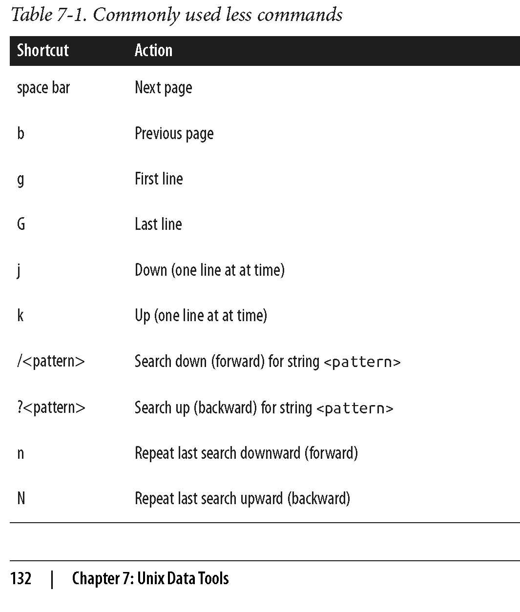
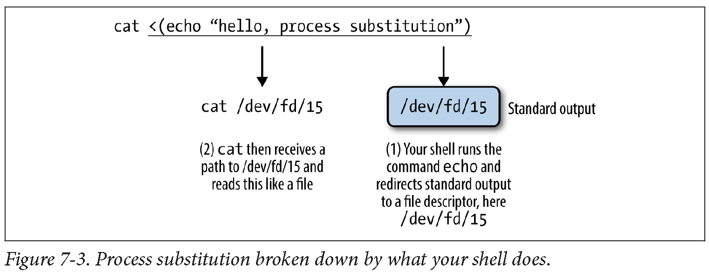

```{r, include=FALSE}
source("../bin/chunk-options.R")
knitr_fig_path("02-")
```

**Note:** The lesson is based on Chapters 6 and 7 of the 
[Bioinformatics Data Skills](http://shop.oreilly.com/product/0636920030157.do) 
by [Vince Buffalo](https://github.com/vsbuffalo)

# Bioinformatic data
## Retrieving bioinformatic data

### Downloading Data with wget and curl
Two common command-line programs for downloading data from the Web are 
[wget](https://www.gnu.org/software/wget/) and [curl](https://curl.haxx.se/). 
If they are not installed on your system, you’ll have to install them 
with a package manager (e.g., Homebrew or apt-get). While `curl` and `wget` 
are similar in basic functionality, their relative strengths are different:  
* `wget` is useful for quickly downloading a file from the command line
* `curl` is used in scripts that send data to a system or recieve data through a variate of protocols, including SFTP and SCP.

To get a file with data for human chromosome 22 from the GRCh37 (also known as hg19) assembly version:

```{bash, eval=FALSE}
wget http://hgdownload.soe.ucsc.edu/goldenPath/hg19/chromosomes/chr22.fa.gz
```

Notice that the link to chromosome 22 begins with “http” (short for Hyper‐Text Transfer Protocol). 
`wget` can also handle FTP links (which start with “ftp,” short for File Transfer Protocol). 
In general, FTP is preferable to HTTP for large files (and is often recommended by websites like 
the UCSC Genome Browser). 

To download chromosome 22 with curl, we’d use:
```{bash, eval=FALSE}
curl http://hgdownload.soe.ucsc.edu/goldenPath/hg19/chromosomes/chr22.fa.gz > chr22.fa.gz
```

### Data Integrity
Data we download into our project directory is the starting point of all future 
analyses and conclusions. So it's important to explicitly check the transferred 
data’s integrity with check‐sums. Checksums are very compressed summaries of data, 
computed in a way that even if just one bit of the data is changed, the checksum 
will be different. As such data integrity checks are also helpful in keeping track
of data versions. Checksums facilitate reproducibility, as we can link a particular 
analysis and set of results to an exact version of data summarized by the 
data’s checksum value.

#### SHA and MD5 Checksums
The two most common checksum algorithms are MD5 and SHA-1. SHA-1 is newer and generally 
preferred. However, MD5 is more common; it’s likely to be what you encounter if a server 
has precomputed checksums on a set of files. To create checksums using SHA-1 we can pass 
arbitrary strings to the program shasum (on some systems, 
it’s sha1sum) through standard in:

```{bash}
echo "bioinformatics is fun" | shasum
echo "bioinformatic is fun" | shasum
```

Checksums are reported in hexadecimal format, where each digit can be one of 16 characters: 
digits 0 through 9, and the letters a, b, c, d, e, and f. The trailing dash indicates this 
is the SHA-1 checksum of input from standard in. 

We can also use checksums with file input:
```{bash}
shasum chr22.fa.gz
```

Because it can get rather tedious to check each checksum individually `shasum` has a convenient 
solution: it can create and validate against a file containing the checksums of files. We can 
create a SHA-1 checksum file for all FASTQ files in the data/ directory as follows:

```{bash, eval=FALSE}
shasum data/*fastq > fastq_checksums.sha
```

Then, we can use shasum’s check option (-c) to validate that these files match the original versions:

```{bash, eval=FALSE}
shasum -c fastq_checksums.sha
```

The program `md5sum` (or `md5` on OS X) calculates MD5 hashes and is similar in operation to `shasum`. 
However, note that on OS X, the md5 command doesn’t have the -c option, so you’ll need to install the 
GNU version for this option.

> ## Keeping records
>
> When we download data from the internet, it's important to include checksum numbers in a README.md file
> for reproducibility, e.g.,
>
> ### Genome and Annotation Data
>
>    Mouse (*Mus musculus*) reference genome version GRCm38 (Ensembl
>    release 74) was downloaded on Sat Feb 22 21:24:42 PST 2014, using:
>        wget ftp://ftp.ensembl.org/pub/release-74/fasta/mus_musculus/dna/Mus_musculus.GRCm38.74.dna.toplevel.fa.gz
>    Gene annotation data (also Ensembl release 74) was downloaded from Ensembl on
>    Sat Feb 22 23:30:27 PST 2014, using:
>        wget ftp://ftp.ensembl.org/pub/release-74/fasta/mus_musculus/dna/Mus_musculus.GRCm38.74.gtf.gz
>    ## SHA-1 Sums
>     - `Mus_musculus.GRCm38.74.dna.toplevel.fa.gz`: 01c868e22a9815c[...]c2154c20ae7899c5f
>     - `Mus_musculus.GRCm38.74.gtf.gz`: cf5bb5f8bda2803[...]708bff59cb575e379
>
> Although this isn’t a lot of documentation, this is infinitely better than not documenting how data was 
> acquired. As this example demonstrates, it takes very little effort to properly track the data that 
> enters your project, and thereby ensure reproducibility. The most important step in documenting your work 
> is that you’re consistent and make it a habit.
>
{: .callout}

# Unix data tools
## Inspecting and Manipulating Text Data with Unix Tools


In this lesson, we'll learn how to use core Unix tools to manipulate and explore plain-text 
data formats. The most common tabular plain-text file format used in bioinformatics is 
tab-delimited. Many Unix tools assume tab-delimited file format by default. Such format is also 
simple to parse with scripting languages like Python and Perl, and easy to load into R.

> ## Tabular Plain-Text Data Formats
> The basic tabular data format is incredibly simple: each row (also known as a record) is kept 
> on its own line, and each column (also known as a field) is separated by some delimiter. There 
> are three flavors you will encounter: tab-delimited, comma-separated, and variable space-delimited. 
> Of these three formats, tab-delimited is the most commonly used in bioinformatics. File formats 
> such as BED, GTF/GFF, SAM, tabular BLAST output, and VCF are all examples of tab-delimited files. 
> Columns of a tab-delimited file are separated by a single tab character (which has the escape code \t). 
> A common convention (but not a standard) is to include metadata on the first few lines of a 
> tab-delimited file. These metadata lines begin with # to differentiate them from the tabular data 
> records. Because tab-delimited files use a tab to delimit columns, tabs in data are not allowed. 
> In general, tab-delimited formats and CSV are better choices than space-delimited formats because 
> it’s quite common to encounter data containing spaces.  
> Despite the simplicity of tabular data formats, there’s one major common 
> headache: how lines are separated. Linux and OS X use a single linefeed character 
> (with the escape code \n) to separate lines, while Windows uses a DOS-style line separator of a carriage 
> return and a linefeed character (\r\n). CSV files generally use this DOS-style too, as this is specified 
> in the CSV specification RFC-4180 (which in practice is loosely followed). Occasionally, you might encounter 
> files separated by only carriage returns.
{: .callout}

In this lesson, we’ll work with very simple genomic feature formats: BED (Browser Extensible Data) 
and GTF (Gene Transfer Format) files. 
These file formats store the positions of features such as genes, exons, and variants in tab-delimited 
format. Don’t worry too much about the specifics of these formats; our goal here is to develop the 
skills to freely manipulate plain-text files or streams using Unix data tools.

---

### Inspecting Data with `head` and `tail`
Although we can print the content of a file on screen with `cat`, a better option is to take a look
at the top of a file with `head` and at the bottom of the file with `tail`. First, download the file 
Mus_musculus.GRCm38.75_chr1.bed (we downloaded them already when we cloned the bds-files repository):

```{bash, eval=FALSE}
curl -O https://raw.githubusercontent.com/Data-Skills/bds-files/master/chapter-07-unix-data-tools/Mus_musculus.GRCm38.75_chr1.bed
curl -O https://raw.githubusercontent.com/Data-Skills/bds-files/master/chapter-07-unix-data-tools/Mus_musculus.GRCm38.75_chr1.gtf
```

Now look at it with `head`:

```{bash}
head -n 3 Mus_musculus.GRCm38.75_chr1.bed
```

The -n argument controls how many lines to display (the default is 10).
`head` has a related command designed to look at the end, or `tail` of a file:

```{bash}
tail -n 3 Mus_musculus.GRCm38.75_chr1.bed
```

One common use of `tail` is to remove the header of a file. If -n is given a number x 
preceded with a + sign (e.g., +x), tail will start from the xth line. So to chop off a 
header, we start from the second line with -n +2. Here, we’ll use the command seq to 
generate a file of 3 numbers, and chop of the first line:

```{bash}
seq 3 > nums.txt
cat nums.txt
echo "---"
tail -n +2 nums.txt
```

Sometimes it’s useful to see both the beginning and end of a file. Foor example, if we have a 
sorted BED file and we want to see the positions of the first feature and last feature. 
We can do this using Unix subshell, the topic we'll cover later:

```{bash}
(head -n 2; tail -n 2) < Mus_musculus.GRCm38.75_chr1.bed
```

We can create even a short‐cut for this command
in your shell configuration file, which is either ~/.bashrc or ~/.profile:

```{bash eval=FALSE}
# inspect the first and last 3 lines of a file
i() { (head -n 2; tail -n 2) < "$1" | column -t; }
```

`head` is also useful for taking a peek at data resulting from a Unix pipeline:

```{bash}
grep 'gene_id "ENSMUSG00000025907"' Mus_musculus.GRCm38.75_chr1.gtf | head -n 1
```

After printing the first few rows of your data the head process exits. When it exits, 
the shell sends a signal to other programs in the pipe called SIGPIPE, much like the 
signal that’s sent when you press Control-c (that signal is SIGINT) that terminates them
as well. When building complex pipelines that process large amounts of data, 
this is extremely important feature.

---

### Viewing data with `less`
`less` is a terminal pager, a program that allows us to view large amounts of 
text in our terminals by scrolling through long files and standard output a 
screen at a time. Once we start less, it will stay open until we quit it by 
pressing `q`. Some other commands in `less` are listed in the table below:



> ## Challenge 1
>
> Let’s look at a file called contaminated.fastq in the book’s GitHub repository.
> Use less to get a quick sense of whether 
> there are 3’ adapter contaminants in the contaminated.fastq file. We’ll look for 
> AGATCGGAAGAGCACACGTCTGAACTCCAGTCAC (a known adapter from the Illumina Tru‐ Seq® kit1). 
> Instead of trying to find the complete sequence, let’s search for the first 11 bases, 
> AGATCGGAAGA. 
>
> - What less commad will you use to search for this sequence?  
> - Are the sequences contaminated?
{: .challenge}

`less` is also extremely useful in debugging our command-line pipelines. You can 
pipe the output of the command you want to debug to less and comment out everything 
after. When you run the pipe, less will capture the output of the last command and 
pause so you can inspect it.

`less` is also crucial when iteratively building up a pipeline. Suppose we have an 
imaginary pipeline that involves three programs, step1, step2, and step3. Our 
finished pipeline will look like  
`step1 input.txt | step2 | step3 > output.txt`. But we may want to build it up in 
pieces, checking the output of each step. The natural way to do this is with less:

```{bash, eval=FALSE}
step1 input.txt | less # inspect output in less 
step1 input.txt | step2 | less
step1 input.txt | step2 | step3 | less
```

A useful behavior of pipes is that the execution of a program with output piped to 
`less` will be paused when `less` has a full screen of data. The result is that we 
can throw less after a complex pipe processing large data and not worry about wasting 
computing power: the pipe will block and we can spend as much time as needed to inspect 
the output.

---

### Obtaining plain-Text Data Summary Information with `wc`, `ls`, and `awk`
In addition to peeking at a file with `head`, `tail`, or `less`, we may want other 
bits of summary information about a plain-text data file like the number of rows or 
columns. With plain-text data formats like tab-delimited and CSV files, the number 
of rows is usually the number of lines. We can retrieve this with the program `wc` (for word count):

```{bash}
wc ../data/Mus_musculus.GRCm38.75_chr1.bed
```

By default, wc outputs the number of words, lines, and characters of the supplied file. Often, 
we only care about the number of lines. We can use option -l to just return the number of lines:

```{bash}
wc -l ../data/Mus_musculus.GRCm38.75_chr1.bed
```

Another bit of information we usually want about a file is its size. The easiest way to do this is 
with our old Unix friend, `ls`, with the -lh option (l for long, h for human-readable:

```{bash}
ls -lh ../data/Mus_musculus.GRCm38.75_chr1.bed
```

> ## Challenge 2
>
> Let’s look at two files we downloaded earlier, Mus_musculus.GRCm38.75_chr1.gtf and 
> Mus_musculus.GRCm38.75_chr1.bed.  
> - What are the sizes of these files?
> - How many lines they contain?
>
{: .challenge}

Note that “M” in `ls -lh` output indicates megabytes; "G" -- gigabytes.

---

### Finding the number of columns with `awk`

There’s one other bit of information we often want about a file: how many columns it contains. 
We could always manually count the number of columns of the first row with head -n 1, but a far 
easier way is to use `awk`. `Awk` is an easy, small programming language great at working with 
text data like TSV and CSV files. We’ll see more of `awk later, but let’s use an awk one-liner 
to return how many fields a file contains:

```{bash}
awk -F "\t" '{print NF; exit}' ../data/Mus_musculus.GRCm38.75_chr1.bed
```

`awk` was designed for tabular plain-text data processing, and
has a built-in variable NF set to the number of fields of the current dataset. 
This awk oneliner simply prints the number of fields of the first row 
of the Mus_musculus.GRCm38.75_chr1.bed file, and then exits. By default, `awk` 
treats white‐space (tabs and spaces) as the field separator, but we changed
this to just tabs by setting the -F argument of `awk`.

Finding how many columns there are in Mus_musculus.GRCm38.75_chr1.gtf is a bit 
trickier because this file has a series of comments in the beginning (marked with #) 
that contain helpful metadata like the genome build, version, date, and accession 
number. One way to fix this is with a tail trick we saw earlier:

```{bash}
tail -n +6 ../data/Mus_musculus.GRCm38.75_chr1.gtf | head -n 1;
echo "---"
tail -n +6 ../data/Mus_musculus.GRCm38.75_chr1.gtf | awk -F "\t" '{print NF; exit}'
```

A better solution would be to simply exclude all lines that match a comment line pattern. 
Using the program grep (which we’ll talk more about it later), we can easily exclude lines 
that begin with “#”:

```{bash}
grep -v "^#" ../data/Mus_musculus.GRCm38.75_chr1.gtf | awk -F "\t" '{print NF; exit}'
```

---

### Working with Column Data with `cut` and `column`

There is another useful program for  working with plain-text tabular data formats: `cut`. 
`Cut` cuts out specified columns (also known as fields) from a text file. By default, 
cut treats tabs as the delimiters, so to extract the second column we use:

```{bash}
cut -f 2 ../data/Mus_musculus.GRCm38.75_chr1.bed | head -n 3
```

The -f argument is how we specify which columns to keep. The argument -f also allows 
us to specify ranges of columns (e.g., -f 3-8) and sets of columns (e.g., -f 3,5,8). 
Note that it’s not possible to reorder columns using using `cut` (e.g., -f 6,5,4,3 will 
not work, unfortunately). But you can use `awk -v OFS="\t" '{ print $6,$5,$4,$3 }'` 
(see extra topics for more info).

> ## Challenge 3
>
> Use cut to convert our GTF for Mus_musculus.GRCm38.75_chr1.gtf to a three-column 
> tab-delimited file of genomic ranges (e.g., chromosome, start, and end position).
> Note that although our three-column file of genomic positions looks like a 
> BED-formatted file, it’s not due to subtle differences in genomic range formats. 
> We’ll learn more about this later.
>  
{: .challenge}

---

### Formatting Tabular Data with `column`
As you may have noticed when working with tab-delimited files, it’s not always easy to see which 
elements belong to a particular column. For example:

```{bash}
grep -v "^#" ../data/Mus_musculus.GRCm38.75_chr1.gtf | cut -f1-8 | head -n 3
```

While tabs are a terrific delimiter in plain-text data files, our variable width data leads our 
columns to not stack up well. There’s a fix for this in Unix: program `column -t` (the -t option 
tells column to treat data as a table). `column -t` produces neat columns that are much easier to 
read:

```{bash}
grep -v "^#" ../data/Mus_musculus.GRCm38.75_chr1.gtf | cut -f1-8 | column -t | head -n 3
```

Note that you should only use `columnt -t` to visualize data in the terminal, not to reformat data 
to write to a file. Tab-delimited data is preferable to data delimited by a variable number of spaces, 
since it’s easier for programs to parse. 

Like cut, column’s default delimiter is the tab character (\t). We can specify a different 
delimiter with the -s option. 

`column` illustrates an important point about how we should treat data: 
there’s no reason to make data formats attractive at the expense of readable 
by programs. This relates to the general recommendation: __“write code for 
humans, write data for computers”__. In general, it’s easier to make computer-
readable data attractive to humans than it is to make data in a human-friendly 
format readable to a computer.

---

### Finding patterns with `grep`

`grep` finds a pattern (fixed string or regular expression) in a file and is faster than 
any other searches you can do in other programs/languages. `grep` requires two arguments: 
the pattern (the string or basic regular expression you want to search for), and the file 
(or files) to search for it in. As a very simple example, let’s use grep to find a gene, 
“Olfr418-ps1,” in the file Mus_musculus.GRCm38.75_chr1_genes.txt (which contains all Ensembl 
gene identifiers and gene names for all protein-coding genes on chromosome 1):

```{bash}
grep "Olfr418-ps1" ../data/Mus_musculus.GRCm38.75_chr1_genes.txt
```

Note that although the quotes around the pattern aren’t required, it’s safest to use them 
so our shells won’t try to interpret any symbols. One useful option when using grep is 
--color=auto. This option enables terminal colors, 
so the matching part of the pattern is colored in your terminal.

```{bash}
grep --color=auto "Olfr" ../data/Mus_musculus.GRCm38.75_chr1_genes.txt | head -n 5
```

> ## GNU, BSD, and the Flavors of Grep
> Up until now, we’ve glossed over a very important detail: there are different implementations 
> of Unix tools. Tools like grep, cut, and sort come from one of two flavors: BSD utils and GNU coreutils. 
> Both of these implementations contain all standard Unix tools we use in this chapter, but their features 
> may slightly differ from each other. BSD’s tools are found on Max OS X and other _Berkeley Software 
> Distribution_-derived operating systems like FreeBSD. GNU’s coreutils are the standard set of tools found 
> on Linux systems. It’s important to know which implementation you’re using (this is easy to tell by reading 
> the man page). If you’re using Mac OS X and would like to use GNU coreutils, you can install these through 
> Homebrew with brew install coreutils. Each program will install with the prefix “g” (e.g., cut would be 
> aliased to gcut), so as to not interfere with the system’s default tools.
> Unlike BSD’s utils, GNU’s coreutils are still actively developed. GNU’s coreutils also have many more 
> features and extensions than BSD’s utils, some of which we use in this chapter. In general, you should use 
> GNU’s coreutils over BSD utils, as the documen‐tation is more thorough and the GNU extensions are helpful.
>
{: .callout}

Note, that when we specify a pattern in grep, we'll also get all the words that partially match
this pattern (e.g., specifying "mito" will also get us "Not-mito"). To get around this, use -w 
to match entire words (strings of characters surrounded by whitespace).  

> ## Challenge 4
>
> Find all the lines in Mus_musculus.GRCm38.75_chr1_genes.txt correspoding to gene names that begin 
> with Olfr.  
> What unix command can you use to count their number?
>  
{: .challenge}

grep’s default output often doesn’t give us enough context of a match when we need to inspect 
results by eye. There are three useful options to get around this: context before (-B), \context after (-A), and context before and after (-C). Each of these arguments takes how many lines of 
context to provide (e.g., -A2)

grep also supports a flavor of regular expression called POSIX Basic Regular 
Expressions (BRE). If you’re familiar with the regular expressions in Perl or 
Python, you’ll notice that grep’s regular expressions aren’t quite as powerful 
as the ones in these lan‐guages. Still, for many simple applications they work 
quite well. For example, if we wanted to find the Ensembl gene identifiers for 
both “Olfr1413” and “Olfr1411,” we could use:

```{bash}
grep "Olfr141[13]" ../data/Mus_musculus.GRCm38.75_chr1_genes.txt
```

However, this approach is less useful if we have more divergent patterns to search for. 
For example, constructing a BRE pattern to match both “Olfr218” and “Olfr1416” would be 
complex and error prone. For tasks like these, it’s far easier to use grep’s support for 
POSIX Extended Regular Expressions (ERE). `grep` allows us to turn on ERE with the -E 
option (which on many systems is aliased to egrep). EREs allow us to use 
alternation to match either “Olfr218” or “Olfr1416.” The syntax uses a pipe symbol (|):

```{bash}
grep -E "(Olfr1413|Olfr1411)" ../data/Mus_musculus.GRCm38.75_chr1_genes.txt
```

We don't have time to talk about regular expressions here. The important part is that you 
recognize there’s a difference and know the terms necessary to find further help when you need it.

We used wc -l above to count the number of matches in `grep`. However, `grep` has an option to do it
itself: -c.  Returning to our previous example counting the genes start with “Olfr”:

```{bash}
grep -c "\tOlfr" ../data/Mus_musculus.GRCm38.75_chr1_genes.txt
```

Counting matching lines is extremely useful—especially with plain-text data 
where lines represent rows in the data. For example, suppose we wanted to know 
how many small nuclear RNAs are in our Mus_musculus.GRCm38.75_chr1.gtf 
file. snRNAs are annotated as gene_biotype "snRNA" in the last column of this GTF file. 
A simple way to count these features would be:

```{bash}
grep -c 'gene_biotype "snRNA"' ../data/Mus_musculus.GRCm38.75_chr1.gtf
```

Note here how we’ve used single quotes to specify our pattern, as our pattern includes 
the double-quote characters ("). 

By default, `grep` is outputting the entire matching line. Sometimes, however, it’s useful 
to use `grep` to extract only the matching part of the pattern. We can do this with -o:

```{bash}
grep -o "Olfr.*" ../data/Mus_musculus.GRCm38.75_chr1_genes.txt | head -n 5
```

Or, suppose we wanted to extract all values of the “gene_id” field from the last column of our 
Mus_musculus.GRCm38.75_chr1.gtf file. This is easy with -o:

```{bash}
grep -E -o 'gene_id "\w+"' ../data/Mus_musculus.GRCm38.75_chr1.gtf | head -n 5
```

Here, we’re using extended regular expressions to capture all gene names in the field. However, 
there’s a great deal of redundancy in our results because our GTF file has multiple features 
(transcripts, exons, start codons, etc.) that all have the same gene name. What if you want 
just a list of unique, sorted gene names? We can do it easily in unix:

```{bash}
grep -E -o 'gene_id "\w+"' ../data/Mus_musculus.GRCm38.75_chr1.gtf | cut -f2 -d" " | sed 's/"//g' | sort | uniq | head -n 10
```

As you can see, we are about half-way through the tools we need to learn!

---

### Sorting Plain-Text Data with `sort`

Often we need to work with sorted plain-text data in bioinformatics. The two most common reasons to 
sort data are as follows:
* Certain operations are much more efficient when performed on sorted data.
* Sorting data is a prerequisite to finding all unique lines, using the Unix `sort | uniq` idiom.

`sort`, like `cut`, is designed to work with plain-text data with columns. Running
`sort` without any arguments simply sorts a file alphanumerically by line:

```{bash}
cat ../data/example.bed
echo "======="
sort ../data/example.bed
```

Because chromosome is the first column, sorting by line effectively groups 
chromosomes together, as these are “ties” in the sorted order. Grouped data 
is quite useful, as we’ll see.

#### Using Different Delimiters with -t

By default, sort treats blank characters (like tab or spaces) as field delimiters. 
If your file uses another delimiter (such as a comma for CSV files), you can specify 
the field separator with -t (e.g., -t",").

#### Specifying columns to sort with -k

Using sort’s defaults of sorting alphanumerically by line doesn’t handle 
tabular data properly. There are two additional features we need:

* The ability to sort by particular columns
* The ability to tell sort that certain columns are numeric values (and not alphanumeric text)

`sort` has a simple syntax to do this:

```{bash}
sort -k1,1 -k2,2n ../data/example.bed
```

Here, -k specifies the sorting keys and their order. Each -k argument takes a
range of columns as start, end, so to sort by a single column we use start,start. Sorting by 
the first column alone leads to many ties in rows with the same chromosomes (e.g., “chr1” 
and “chr3”). Adding a second -k argument with a different column tells sort how to break 
these ties. In our example, -k2,2n tells sort to sort by the second column (start position), 
treating this column as numerical data (because there’s an n in -k2,2n). If you need all 
columns to be sorted numerically, you can use the argument -n rather
than specifying which particular columns are numeric.

#### Additional options in sort: -s, -c, -r, -V

- When we try to sort two lines are exactly identical according to all 
sorting keys we’ve specified, `sort` will sort them according to the entire line. 
If we don’t want sort to change the order of lines that are equal according to our 
sort keys, we can use the -s option, which turns off this last-resort sorting.

- If you have a file that you suspect is already 
sorted, it’s much cheaper to validate that it’s indeed sorted rather than resort it. 
We can check if a file is sorted according to our -k arguments using -c:

- If we want to sort in reverse order, we use the -r option.  But notice two possibilities:

```{bash}
sort -k1,1 -k2,2n -r ../data/example.bed
echo "==========="
sort -k1,1 -k2,2nr ../data/example.bed
```

Finally, GNU sort has an option -V, which is a clever alphanumeric 
sorting routine that understands numbers inside strings. Consider the difference:

```{bash}
gsort -k1,1 -k2,2n ../data/example2.bed
echo "==========="
gsort -k1,1V -k2,2n ../data/example2.bed
```

---

### Finding Unique Values with `uniq`

`Uniq` takes lines from a file or standard input stream, and outputs all 
lines with consecutive duplicates removed. While this is a relatively simple 
functionality, you will use `uniq` very frequently in command-line data processing. 
Let’s first see an example of its behavior:

```{bash}
cat ../data/letters.txt
echo "=========="
uniq ../data/letters.txt
```

Because `uniq` only removes consecutive duplicate lines (keeping one), if we want to 
find all unique lines in a file, we would first sort all lines using `sort` 
and then run `uniq`:

```{bash}
sort ../data/letters.txt | uniq
```

`uniq` also has a tremendously useful option that’s used 
very often in command-line data processing: -c. This option shows the counts of occurrences 
next to the unique lines. For example:

```{bash}
uniq -c ../data/letters.txt
echo "=========="
sort ../data/letters.txt | uniq -c
```

Both `sort | uniq` and `sort | uniq -c` are frequently used shell idioms in bioinformatics 
and worth memorizing. Combined with other Unix tools like `grep` and `cut`, `sort` and `uniq` 
can be used to summarize columns of tabular data:

```{bash}
grep -v "^#" ../data/Mus_musculus.GRCm38.75_chr1.gtf | cut -f3 | sort | uniq -c
```

Because `sort` and `uniq` are line-based, we can create lines from multiple columns to count 
combinations, like how many of each feature (column 3 in this example GTF) are on each 
strand (column 7):

```{bash}
grep -v "^#" ../data/Mus_musculus.GRCm38.75_chr1.gtf | cut -f3,7 | sort | uniq -c
```

Or, if you want to see the number of features belonging to a particular gene identifier:

```{bash}
grep "ENSMUSG00000033793" Mus_musculus.GRCm38.75_chr1.gtf | cut -f3 | sort | uniq -c
```

These count tables are incredibly useful for summarizing columns of categorical data. 
Without having to load data into a program like R or Excel, we can quickly calculate 
summary statistics about our plain-text data files. 

`uniq` can also be used to check for duplicates with the -d option, which tells the program
to output duplicated lines only. For example, the mm_gene_names.txt file (which contains a 
list of gene names) does not have duplicates:

```{bash}
uniq -d ../data/mm_gene_names.txt | wc -l
```

A file with duplicates, like the test.bed file, has multiple lines returned: 

```{bash}
uniq -d ../data/test.bed | wc -l
```

---

### Joining two files with `join`
The Unix tool join is used to join different files together by a common column. For example,
we may want to add chromosome lengths recorded in example_lengths.txt to example.bed BED file, 
we saw earlier. The files look like this:

```{bash}
cat ../data/example.bed
echo "=========="
cat ../data/example_lengths.txt
```

To do this, we need to join both of these tabular files by their common column, 
the one containing the chromosome names. But first, we first need to sort both 
files by the column to be joined on (join would not work otherwise): 


```{bash}
sort -k1,1 ../data/example.bed > ../data/example_sorted.bed
sort -c -k1,1 ../data/example_lengths.txt # verifies is already sorted
```

The basic syntax is `join -1 <file_1_field> -2 <file_2_field> <file_1> <file_2>`. So, with 
example.bed and example_lengths.txt this would be:

```{bash}
join -1 1 -2 1 ../data/example_sorted.bed ../data/example_lengths.txt > ../data/example_with_lengths.txt
cat example_with_lengths.txt
```

There are many types of joins. For now, it’s important that we make sure join is working 
as we expect. Our expectation is that this join should not lead to fewer rows than in our 
example.bed file. We can verify this with wc -l:

```{bash}
wc -l ../data/example_sorted.bed ../data/example_with_lengths.txt
```

However, look what happens if our second file, example_lengths.txt doesn’t have the 
lengths for chr3:

```{bash}
head -n2 ../data/example_lengths.txt > ../data/example_lengths_alt.txt #truncate file
join -1 1 -2 1 ../data/example_sorted.bed ../data/example_lengths_alt.txt
join -1 1 -2 1 ../data/example_sorted.bed ../data/example_lengths_alt.txt | wc -l
```

Because chr3 is absent from example_lengths_alt.txt, our join omits rows from 
example_sorted.bed that do not have an entry in the first column of 
example_lengths_alt.txt. If we don’t want this behavior, we can use option -a 
to include unpairable lines—ones that do not have an entry in either file:

```{bash}
gjoin -1 1 -2 1 -a 1 ../data/example_sorted.bed ../data/example_lengths_alt.txt # GNU join only
```

Unix’s join is just one of many ways to join data, and is most useful for simple 
quick joins. Joining data by a common column is a common task during data analysis; 
we’ll see how to do this in R later.

---

## Stream Editing with `sed`

Unix pipes are fast because they operate on streams of data (rather than data written to disk). 
Often we need to make trivial edits to a stream, usually to prepare it for the next step in a 
Unix pipeline. The stream editor, or `sed`, allows you to do exactly that.

> ## GNU Sed versus BSD Sed
> As with many other Unix tools, the BSD and GNU versions of `sed` differ considerably in behavior. 
> The GNU version of `sed` is usually preferred (and is used here) as it has some additional 
> features, and supports functionality such as escape codes for special characters like tab (\t) 
> we expect in command-line tools.
{: .callout}

`sed` reads data from a file or standard input and can edit a line at a time. Let’s look at a very 
simple example: converting a file (chroms.txt) containing a single column of chromosomes in the 
format “chrom12,” “chrom2,” and so on to the format “chr12,” “chr2,” and so on:

```{bash}
head -n 3 ../data/chroms.txt # before sed
echo "=========="
sed 's/chrom/chr/' ../data/chroms.txt | head -n 3
```

It’s a simple but important change: although chroms.txt is a mere 10 lines long, it could 
be 500 gigabytes of data and we can edit it without opening the entire file in memory. 

In the preceding code works we uses sed’s substitute command, which has
the syntax `s/pattern/replacement/`.

By default, sed only replaces the first occurrence of a match. To 
replace all occurrences of strings that match our pattern we set the global flag g 
after the last slash: `s/pattern/replacement/g`. To make matching case-insensitive, 
add the flag i (e.g., `s/pattern/ replacement/i`).
By default, sed’s substitutions use POSIX Basic Regular Expressions (BRE). As with 
`grep`, we can use the -E option to enable POSIX Extended Regular Expressions (ERE).  

We can also capture chunks of text that match a pattern, 
and use these chunks in the replacement (often called grouping and capturing). For 
example the following code captures the chromosome name, and start and end positions 
in a string containing a genomic region in the format "chr1:28427874-28425431", and 
output this as three columns:

```{bash}
echo "chr1:28427874-28425431" | sed -E 's/^(chr[^:]+):([0-9]+)-([0-9]+)/\1\t\2\t\3/'
```

Note that we capture chunks of text by surrounding matching pattersn with ( and ). 

> ## Challenge 5
>
> Come up with some alternative solutions to problem above.
> ```
>
> > ## Solution to challenge 5
> >
> > ```{bash}
> > echo "chr1:28427874-28425431" | sed 's/[:-]/\t/g'
> > echo "chr1:28427874-28425431" | sed 's/:/\t/' | sed 's/-/\t/' # or sed -e 's/:/\t/' -e 's/-/\t/
> > echo "chr1:28427874-28425431" | tr ':-' '\t'
> > ```
> > Note, that in the last example we use `tr` to translate both delimiters to a tab character. 
> > `tr` translates all occurrences of its first argument to its second (see `man tr` for more details).
> >
> {: .solution}
{: .challenge}

By default, `sed` prints every line, making replacements to matching lines. To print only the lines 
that match a pattern, we use the `-n` option and than append the `p` flag after the last slash:

```{bash}
grep -v "^#" ../data/Mus_musculus.GRCm38.75_chr1.gtf | head -n 3 | sed -E -n 's/.*transcript_id "([^"]+)".*/\1/p'
```

Note that the example uses an important regular expression idiom: capturing text between delimiters 
(in this case, quotation marks): `"([^"]+)"`. In regular extension jargon, the brackets make 
up a character class. Character classes specify what characters the expression is allowed to 
match. Here, we use a caret (^) inside the brackets to match anything except what’s inside these 
brackets.

It’s also possible to select and print certain ranges of lines with sed. In this case, we’re 
not doing pattern matching, so we don’t need slashes:

```{bash}
sed -n '1,5p' ../data/Mus_musculus.GRCm38.75_chr1.gtf
echo "============"
sed -n '40,45p' ../data/Mus_musculus.GRCm38.75_chr1.gtf
```

Substitutions make up the majority of sed’s usage cases, but `sed` has features that allow you 
to make any type of edit to a stream of text. However, for complex stream processing tasks it 
can be easier to write a Python script than a long and complicated sed command. Remember the 
KISS principal: Keep Incredible Sed Simple.

## Advanced Shell Tricks

### Subshells

The first trick we’ll cover is using Unix subshells. Before explaining this trick, it’s helpful 
to remember the difference between sequential commands (connected with && or ;), and piped commands 
(connected with |). Sequential commands are simply run one after the other. In contrast, connecting two 
programs with pipes means the first program’s standard out will be piped into the next program’s 
standard in.

The difference between sequential commands linked with && and ; comes down to exit status: if we run 
two commands with `command1 ; command2`, command2 will always run, regardless of whether command1 
exits successfully (with a zero exit status). In contrast, if we use `command1 && command2`, command2 
will only run if command1 completed with a zero-exit status. So how do subshells fit into all of this? 

Subshells allow us to execute sequential commands together in a separate shell process. This is 
useful primarily to group sequential commands together (such that their output is a single stream). 
This gives us a new way to construct clever oneliners and has practical uses in command-line data 
processing. Let’s look at a toy example first:

```{bash}
echo "this command"; echo "that command" | sed 's/command/step/'
```


```{bash}
(echo "this command"; echo "that command") | sed 's/command/step/'
```

Grouping both `echo` commands together using parentheses causes these two commands to be run 
in a separate subshell, and both commands’ combined standard output is passed to sed. Combining 
two sequential commands’ standard output into a single stream with a subshell is a useful trick, 
and one we can apply to shell problems in bioinformatics.

Consider the problem of sorting a GTF file with a metadata header. We can’t simply sort the entire 
file with sort, because this header could get shuffled in with rows of data. Instead, we want to 
sort everything except the header, but still include the header at the top of the final sorted file. 
We can solve this problem using a subshell to group sequential commands that print the header to 
standard out and sort all other lines by chromosome and start position, printing all lines to standard 
out after the header:

```{bash}
(grep "^#" ../data/Mus_musculus.GRCm38.75_chr1.gtf; grep -v "^#" ../data/Mus_musculus.GRCm38.75_chr1.gtf | sort -k1,1 -k4,4n) | less | head -n 10
```

We can redirect the output to gzip to compress this stream before writing it to disk:

```{bash eval=FALSE}
(zgrep "^#" ../data/Mus_musculus.GRCm38.75_chr1.gtf.gz; zgrep -v "^#" ../data/Mus_musculus.GRCm38.75_chr1.gtf.gz | sort -k1,1 -k4,4n) | ` | gzip > ../data/Mus_musculus.GRCm38.75_chr1_sorted.gtf.gz
```

### Named Pipes and Process Substitution

Throughout this chapter, we’ve used pipes to connect command-line tools to build custom 
data-processing pipelines. However, some programs won’t interface with the Unix pipes 
because they, for example, read in multiple input files and write to multiple output files:

```{bash eval=FALSE}
processing_tool --in1 in1.fq --in2 in2.fq --out1 out2.fq --out2.fq
```

Because each file needs to be provided separately, we can’t pipe the previous processing 
step’s results through processing_tool’s standard in. Likewise, this program creates two 
separate output files, so it isn’t possible to pipe it’s standard output to another program 
in the processing pipeline. Fortunately, Unix provides 
a solution: named pipes. A named pipe, also known as a FIFO (First In First Out, a concept in 
computer science), is a special sort of file that is persistent 
on your filesystem. We can create a named pipe with the program mkfifo:

```{bash}
mkfifo fqin
ls -l fqin
```

You can see that this is indeed a special type of file: the p before the file permissions is 
for pipe. Just like pipes, one process writes data into the pipe, and another process reads 
data out of the pipe. As an example:

```{bash}
echo "hello, named pipes" > fqin &
cat fqin
rm fqin
```

Treating the named pipe just as we would any other file, we can access the data we wrote to it 
earlier. Although the syntax is similar to shell redirection to a file, we’re not actually 
writing anything to our disk. Named pipes provide all of the computational benefits of pipes with 
the flexibility of interfacing with files. However, creating and removing them is a bit tedious. 
So there’s a way to use named pipes without having to explicitly create 
them. This is called process substitution, or sometimes known as anonymous named pipes. If we were 
to re-create the previous toy example with process substitution, it would look as follows:

```{bash}
cat <(echo "hello, process substitution")
```

The chunk <(echo "hello, process sub stition") runs the echo command and pipes the output to an 
anonymous named pipe. Your shell then replaces this chunk (the <(...) part) with the path to 
this anonymous named pipe. No named pipes need to be explicitly created, but you get the same 
functionality. Process substitution allows us to connect two (or potentially more) programs, 
even if one doesn’t take input through standard input. This is illustrated in the following figure:



In the program example we saw earlier, two inputs were needed (--in1 and --in2). For the sake of 
this example, assume that a program called `makein` is creating the input streams for --in1 and --in2. 
We can use process substitution to create two anynyous pipes:

```{bash, eval=FALSE}
program --in1 <(makein raw1.txt) --in2 <(makein raw2.txt) --out1 out1.txt --out2 out2.txt
```

Pprocess substitution can also be used to capture an output stream. For example,

```{bash, eval=FALSE}
program --in1 in1.txt --in2 in2.txt --out1 >(gzip > out1.txt.gz) --out2 >(gzip > out2.txt.gz)
```

will creates two anonymous named pipes, and their input is then passed to the `gzip` command. 
`gzip` then compresses these and writes to standard out, which we redirect to our gzipped files.

## The Unix Philosophy Revisited

Throughout this chapter, we saw how to use a rich set of Unix tools to solve various tasks in
data analysis. Not only are Unix 
piped workflows fast to construct, easy to debug, and versatile, but they’re often the most 
computationally efficient solution, too. It’s a testament to the incredible design of Unix that 
so much of the way we approach modern bioinformatics is driven by the almighty Unix pipe, a 
piece of technology invented over 40 years ago in “one feverish night” by Ken Thompson (as 
described by Doug McIlroy).

# EXTRA TOPICS 
## 1. Awk and Bioawk
### Processing text with Awk
We used `awk` a few times in the tutorial but here we discussed it in more details.

`Awk` is a tiny, specialized language that allows you to do a variety of 
text-processing tasks with ease. The key to using Awk effectively is to reserve 
it for the subset of tasks it’s best at --- quick data-processing tasks on tabular 
data. Learning Awk will also prepares us to learn `bioawk`, which we’ll cover later.

There are two key parts for understanding the Awk language: how Awk processes records, 
and pattern-action pairs. The rest of the language is quite simple.

- Awk processes input data a record (line) at a time. Each record is composed of fields 
(column entries) that Awk automatically separates. Awk assigns the entire record 
to the variable $0, field one’s value to $1, field two’s value to $2, etc.

- We build Awk programs using one or more of the following structures: `pattern { action }`.
Each pattern is an expression or regular expression pattern. In Awk lingo, these are 
pattern-action pairs and we can chain multiple pattern-action pairs together (separated by semicolons). 
If we omit the pattern, Awk will run the action on all records. If we omit the action but 
specify a pattern, Awk will print all records that match the pattern.

Let’s see some examples.

First, `awk` can mimic `cat` by omitting a pattern and printing an entire record with the variable $0:

```{bash}
awk '{ print $0 }' ../data/example.bed #emulating cat
```

We could even omit the $0, because print called without an argument would print the current record.

Second, `awk` can mimic `cut` by omitting a patter, but selecting only certain columns:

```{bash}
awk '{ print $2 "\t" $3 }' ../data/example.bed #emulating cut
```

Notice that although it was far more typing than using `cut -f2,3`, `awk` is much more flexible:

```{bash}
awk '{ print $3 "\t" $2 }' ../data/example.bed #emulating cut
```

We can incorporate simple pattern matching to select specific records, for example
only lines where the length of the feature (end position - start position) was greater 
than 18:

```{bash}
awk '$3 - $2 > 18 { print $2 "\t" $3 }' ../data/example.bed
```

Awk supports arithmetic with the standard operators 
+, -, *, /, % (remainder), and ^ (exponentiation) as well as comparison and logical operations:  
a==b  | a!=b | a < b | a > b | a<=b | a>=b | a ~ b | a!~b | a&&b | a||b | !a, were 

~ indicates matching regular expression pattern,
&& logical a and b
|| logical a or b
! logical negation

We can also chain patterns, by using logical operators && (AND), || (OR), and ! (NOT). 

For example, if we wanted all lines on chromosome 1 with a length greater than 10:

```{bash}
awk '$1 ~ /chr1/ && $3 - $2 > 10' example.bed
```

The first pattern, $1 ~ /chr1/, is how we specify a regular expression. Regular expressions 
are in slashes.To not match the regular expression we would use !~ (or !($1 ~ /chr1/)).

We can combine patterns and more complex actions than just printing the entire record. For example, 
if we wanted to add a column with the length of this feature (end position - start position) for 
only chromosomes 2 and 3, we could use:

```{bash}
awk '$1 ~ /chr2|chr3/ { print $0 "\t" $3 - $2 }' example.bed
```

Let’s look at some slightly more advanced awk's feature. `awk` recognizes two 
special patterns: BEGIN and END. The BEGIN pattern specifies what to do before 
the first record is read in, and END specifies what to do after the last record’s 
processing is complete. BEGIN is useful to initialize and set up variables, and END 
is useful to print data summaries at the end of file processing. 

For example, suppose we wanted to calculate the mean feature length in example.bed. 
We would have to take the sum feature lengths, and then divide by the total number 
of records. We can do this with:

```{bash eval=FALSE}
awk 'BEGIN{ s = 0 }; { s += ($3-$2) }; END{ print "mean: " s/NR };'
```

There’s a special variable we’ve used here, one that Awk automatically assigns in addition 
to $0, $1, $2, etc.: NR. NR is the current record number, so on the last record NR is set 
to the total number of records processed. In this example, we’ve initialized a variable `s` 
to 0 in BEGIN (variables you define do not need a dollar sign). Then, for each record we 
increment `s` by the length of the feature. At the end of the records, we print this sum `s` 
divided by the number of records NR, giving the mean.

#### Setting Field, Output Field, and Record Separators
By default, `awk` expects whitespace-separated tabular data, but a 
different field separator can be set with the -F argument. 
It’s also possible to set the record (RS), output field (OFS), and output record (ORS) 
separators. These variables can be set with the -v argument, using the syntax 
`awk -v VAR=val`: 

```{bash eval=FALSE}
awk -F"," -v OFS="\t" {print $1,$2,$3}
```

Setting OFS="\t" saves a few extra characters when outputting tab-delimited results with/ 
statements like print "$1 "\t" $2 "\t" $3.

We saw how to use NR variable to calculate the mean above. We can use it also to extract 
ranges of lines; for example, if we wanted to extract all lines between 3 and 5 (inclusive):

```{bash}
awk 'NR >= 3 && NR <= 5' ../data/example.bed
```

Awk makes it easy to convert between bioinformatics files like BED and GTF. For example, 
we could generate a three-column BED file from Mus_musculus.GRCm38.75_chr1.gtf as follows:

```{bash}
awk '!/^#/ { print $1 "\t" $4-1 "\t" $5 }' ../data/Mus_musculus.GRCm38.75_chr1.gtf | head -n 3
```

Note that we subtract 1 from the start position to convert to BED format. This is because BED 
uses zero-indexing while GTF uses 1-indexing. 

Awk also has a very useful data structure known as an associative array. Associative arrays 
behave like Python’s dictionaries or hashes in other languages. We can create an associative 
array by simply assigning a value to a key. For example, suppose we wanted to count the number 
of features (third column) belonging to the gene “Lypla1.” We could do this by incrementing 
their values in an associative array:

```{bash}
awk '/Lypla1/ { feature[$3] += 1 }; END { for (k in feature) print k "\t" feature[k] }' ../data/Mus_musculus.GRCm38.75_chr1.gtf
```

It’s worth noting that there’s an entirely Unix way to count features of a particular gene: 
grep, cut, sort, and uniq -c:

```{bash}
grep "Lypla1" ../data/Mus_musculus.GRCm38.75_chr1.gtf | cut -f 3 | sort | uniq -c
```

However, if we needed to also filter on column-specific information (e.g., strand), an approach 
using just base Unix tools would be quite messy. With Awk, adding an additional filter would be 
trivial: we’d just use && to add another expression in the pattern.

### Bioawk: An Awk for Biological Formats
Bioawk extends Awk’s powerful processing of tabular data to processing tasks involving common 
bioinformatics formats like FASTA/FASTQ, GTF/GFF, BED, SAM, and VCF. Bioawk is written by Heng Li, 
author of other excellent bioinformatics tools such as BWA and Samtools). You can download, compile, 
and install Bioawk from source, or if you use Mac OS X’s Homebrew package manager, Bioawk is also 
in homebrew-science (so you can install with `brew tap homebrew/science; brew install bioawk`).
The basic idea of Bioawk is that we specify what bioinformatics format we’re working with, 
and Bioawk will automatically set variables for each field (just as regular Awk sets the columns 
of a tabular text file to $1, $1, $2, etc.). For Bioawk to set these fields, specify the format 
of the input file or stream with -c. Let’s look at Bioawk’s supported input formats and what 
variables these formats set:

```{bash}
bioawk -c help bed
```

As an example of how this works, let’s read in example.bed and append a column with the length of 
the feature (end position - start position) for all protein coding genes:

```{bash}
bioawk -c gff '$3 ~ /gene/ && $2 ~ /protein_coding/ {print $seqname,$end-$start}' ../data/Mus_musculus.GRCm38.75_chr1.gtf | head -n 4
```

Bioawk is also quite useful for processing FASTA/FASTQ files. For example, we could use it 
to turn a FASTQ file into a FASTA file:

```{bash}
bioawk -c fastx '{print ">"$name"\n"$seq}' ../data/contam.fastq | head -n 4
```

Note that Bioawk detects whether to parse input as FASTQ or FASTA when we use -c fastx.  

Bioawk can also serve as a method of counting the number of FASTQ/FASTA entries:

```{bash}
bioawk -c fastx 'END{print NR}' ../data/contam.fastq
```

Or Bioawk’s function `revcomp()` can be used to reverse complement a sequence:

```{bash}
bioawk -c fastx '{print ">"$name"\n"revcomp($seq)}' contam.fastq | head -n 4
```

Bioawk is also useful for creating a table of sequence lengths from a FASTA file. 
For example, to create a table of all chromosome lengths of the Mus musculus genome:

```{bash}
bioawk -c fastx '{print $name,length($seq)}' Mus_musculus.GRCm38.75.dna_rm.toplevel.fa.gz > mm_genome.txt
head -n 4 mm_genome.txt
```

Finally, Bioawk has two options that make working with plain tab-delimited files easier: 
-t and -c hdr. -t is for processing general tab-delimited files; it sets Awk’s field 
separator (FS) and output field separator (OFS) to tabs. The option -c hdr is for 
unspecific tab-delimited formats with a header as the first line. This option sets 
field variables, but uses the names given in the header. Suppose we had a simple 
tab-delimited file containing variant names and genotypes for individuals (in columns):

```{bash}
head -n 4 ../data/genotypes.txt
```

If we wanted to return all variants for which individuals ind_A and ind_B have identical genotypes
(note that this assumes a fixed allele order like ref/alt or major/minor):

```{bash}
bioawk -c hdr '$ind_A == $ind_B {print $id}' ../data/genotypes.txt
```

## 2. Decoding Plain-Text Data: hexdump
In bioinformatics, the plain-text data we work with is often encoded in ASCII. ASCII is a character encoding 
scheme that uses 7 bits to represent 128 different values, including letters (upper- and lowercase),
numbers, and special nonvisible characters. While ASCII only uses 7 bits, nowadays computers use an 8-bit byte 
to store ASCII characters. More information about ASCII is available in your terminal through man ascii. Because 
plain-text data uses characters to encode information, our encoding scheme matters. When working with a plain-text 
file, 98% of the time you won’t have to worry about the details of ASCII and how your file is encoded. However, 
the 2% of the time when encoding does matter—usually when an invisible non-ASCII character has entered data—
it can lead to major headaches. In this section, we’ll cover the basics of inspecting text data at a low level 
to solve these types of problems. If you’d like to skip this section for now, bookmark it in case you run into 
this issue at some point.

First, to look at a file’s encoding use the program `file`, which infers what the encoding is from the file’s 
content. For example, we see that many of the example files we’ve been working with in this chapter are ASCII-encoded:

```{bash}
file ../data/Mus_musculus.GRCm38.75_chr1*
```

Some files will have non-ASCII encoding schemes, and may contain special characters. The most common character 
encoding scheme is UTF-8, which is a superset of ASCII but allows for special characters. For example, the utf8.txt 
included in the GitHub directory is a UTF-8 file, as evident from file’s output:

```{bash}
file ../data/utf8.txt
```

Because UTF-8 is a superset of ASCII, if we were to delete the special characters in this file and save it, 
file would return that this file is ASCII-encoded. Most files you’ll download from data sources like Ensembl, 
NCBI, and UCSC’s Genome Browser will not have special characters and will be ASCII-encoded. Often, the problems 
you'll run into are from data generated by humans, which through copying and pasting data from other sources may 
lead to unintentional special characters. For example, the improper.fa file in the GitHub repository looks like 
a regular FASTA file upon first inspection:

```{bash}
cat ../data/improper.fa
```

However, finding the reverse complement of these sequences using `bioawk (don’t worry about the details of this 
program yet—we’ll cover it later) leads to strange results:

```{bash}
bioawk -cfastx '{print revcomp($seq)}' ../data/improper.fa
```

What’s going on? We have a non-ASCII character in our second sequence:

```{bash}
file ../data/improper.fa
```

We can use `hexdump` program to identify which letter is causing this problem. 
The hexdump program returns the hexadecimal values of each character. 
With the -c option, this also prints the character:

```{bash}
hexdump -c data/improper.fa
```

As we can see, the character after “CGAGCGAG” in the second sequence is clearly not an ASCII character. 
Another way to see non-ASCII characters is using grep with an option to look for 
characters outside a hexadecimal range: `grep --color='auto' -P '[\x80-\xFF] improper.fa`. Note that this 
does not work with BSD grep, the version that comes with Mac OS X.
