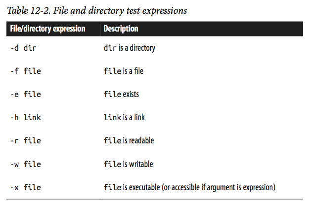

```{r, include=FALSE}
source("../bin/chunk-options.R")
knitr_fig_path("02-")
```

**Note:** The lesson is based on Chapter 12 of the 
[Bioinformatics Data Skills](http://shop.oreilly.com/product/0636920030157.do) 
by [Vince Buffalo](https://github.com/vsbuffalo)

# Bioinformatics Shell Scripting, Writing Pipelines, and Parallelizing Tasks

In this lesson, we’ll learn the essential tools and skills to construct robust and 
reproducible pipelines. We’ll see how to write rerunnable Bash shell scripts, 
automate file-processing tasks with `find` and `xargs`, run pipelines in parallel, 
and see a simple makefile. 

## Basic Bash Scripting
Bash, the shell we’ve used for this class, is also a full-fledged scripting language. 
Bash is explicitly designed to make running and interfacing 
command-line programs as simple as possible (a good characteristic of a shell!). 
Note that Python may be a more suitable language for commonly reused or 
advanced pipelines. Python is a more modern, more fully featured scripting language than Bash. 
Compared to Python, Bash lacks several nice features useful for data-processing scripts. 
However, Bash is often the best and quickest “duct tape” solution (which we often need 
in bioinformatics).

> ## Challenge 1
>
> As you may remember, Unix provides different flavors of shells:
>
> * Bourne shell (sh)
> * C shell (csh)
> * TC shell (tcsh)
> * Korn shell (ksh)
> * Bourne Again shell (bash)
>
> How to check what shell you are using?
>
>
> > ## Solution to Challenge 1
> > $SHELL gives you the default shell. $0 gives you the current shell.
> > ```{bash}
> > echo $0
> > ```
> {: .solution}
{: .challenge}

### Writing and Running Robust Bash Scripts
Most Bash scripts in bioinformatics are simply commands organized into a re-runnable 
script with some added bells and whistles to check that files exist and ensuring any 
error causes the script to abort. These types of Bash scripts are quite simple to write: 
you’ve already learned important shell features like pipes, redirects, and background 
processes that play an important role in Bash scripts.

#### A robust Bash header
Anytime you write a Bash script, you should use the following Bash script header, 
which sets some Bash options that lead to more robust scripts:

```{bash, eval=FALSE}
#!/bin/bash
    set -e
    set -u
    set -o pipefail
```

* The first line is called the shebang, and indicates the path to the interpreter 
used to execute this script. Although shebang line is only required when running 
the script as a program, it’s best to include it.

* `set -e` tells the script to terminate if any command exited with a nonzero exit 
status. Note, however, that set -e has complex rules to accommodate cases when a 
nonzero exit status indicates “false” rather than failure. 

* `set -u` tells Bash scripts not to run any command containing a reference to an 
unset variable name (check `echo "rm $NOTSET/*.*"`.

* `set -o pipefail` is needed to cover one of the exceptions of `set -e`: if the last 
program terminates with a nonzero status, the pipe will not be terminated.

These three options are the first layer of protection against Bash scripts with silent 
errors and unsafe behavior.

#### Running Bash scripts
Running Bash scripts can be done one of two ways: with the bash program directly (e.g., 
bash script.sh), or calling your script as a program (./script.sh). While we can run any 
script (as long as it has read permissions) with `bash script.sh`, calling the script as 
an executable requires that it have executable permissions. We can set these using:
`chmod u+x script.sh`. This adds executable permissions (+x) for the user who owns the 
file (u). 

Unlike other programming languages, Bash’s variables don’t have data types. It’s helpful 
to think of Bash’s variables as strings (but that may behave differently depending on context). 
We can create a variable and assign it a value with (note that spaces matter when setting 
Bash variables: do not use spaces around the equals sign!):

```{bash, eval=FALSE}
results_dir="results/"
```

To access a variable’s value, we use a dollar sign in front of the variable’s name (e.g., 
$results_dir). You can experiment with this in a Bash script, or directly on the command line:

```{bash}
results_dir="results/"
echo $results_dir
```

Even though accessing a variable’s value using the dollar sign syntax works, in some cases 
it’s not clear where a variable name ends and where an adjacent 
string begins. To fix this, wrap the variable name in braces:

```{bash, eval=FALSE}
sample="CNTRL01A"
mkdir ${sample}_aln/
```

In addition, quoting variables makes your code more robust by preventing commands from 
interpreting any spaces or other special characters that the variable may contain: 


```{bash, eval=FALSE}
sample="CNTRL01A"
mkdir "${sample}_aln/"
```

### Variables and Command-line arguments
Let’s now look at how Bash handles command-line arguments (which are assigned to the value 
$1, $2, $3, etc.). The variable $0 stores the name of the script. We can see this ourselves 
with a simple example script:

```{bash}
echo '
#!/bin/bash 
echo "script name: $0"
echo "first arg: $1"
echo "second arg: $2"
echo "third arg: $3" ' > args.sh
bash args.sh arg1 arg2 arg3
```

Bash assigns the number of command-line arguments to the variable $# (this does not count 
the script name, $0, as an argument). This is useful for user-friendly messages (this uses 
a Bash if conditional, which we’ll cover in more depth in the next section):

```{bash}
echo '
#!/bin/bash 
if [ "$#" -lt 3 ] # are there less than 3 arguments? 
then
    echo "error: too few arguments, you provided $#, 3 required"
    echo "usage: script.sh arg1 arg2 arg3"
    exit 1
fi
echo "script name: $0"
echo "first arg: $1"
echo "second arg: $2"
echo "third arg: $3" ' > args.sh
bash args.sh arg1 arg2
```

Note, that variables created in your Bash script will only be available for 
the duration of the Bash process running that script. For example, running a 
script that creates a variable with some_var=3 will not create some_var in your 
current shell, as the script runs in an entirely separate shell process.

### Conditionals in a Bash Script: if Statements
Like other scripting languages, Bash supports the standard if conditional statement. 
What makes Bash a bit unique is that a command’s exit status provides the true and 
false (remember: contrary to other languages, 0 represents true/success and anything 
else is false/failure). The basic syntax is:

```{bash, eval=FALSE}
if [commands] then
    [if-statements] 
else
    [else-statements] 
fi
```

were [commands] is a placeholder for any command, set of commands, pipeline, or test condition
[if-statements] is a placeholder for all statements executed if [commands] evaluates to true (0).
[else-statements] is a placeholder for all statements executed if [commands] evaluates to false (1). 
The else block is optional.

This is an advantage Bash has over Python when writing pipelines: Bash allows your scripts to 
directly work with command-line programs without requiring any overhead to call programs. 

For example, suppose we wanted to run a set of commands only if a file contains a certain 
string. Because grep returns 0 only if it matches a pattern in a file and 1 otherwise, 
we could use:

```{bash, eval=FALSE}
echo `#!/bin/bash
if grep "pattern" some_file.txt > /dev/null 
    then
    # commands to run if "pattern" is found
    echo "found 'pattern' in 'some_file.txt" 
fi`
```

The set of commands in an if condition can use all features of Unix we’ve mastered so far. 
For example, chaining commands with logical operators like `&&` (logical AND) and `||` (logical OR):

```{bash, eval=FALSE}
#!/bin/bash
if grep "pattern" file_1.txt > /dev/null && grep "pattern" file_2.txt > /dev/null
  then echo "found 'pattern' in 'file_1.txt' and in 'file_2.txt'" 
fi
# We can also negate our program’s exit status with !: 
# if ! grep "pattern" some_file.txt > /dev/null 
  # then echo "did not find 'pattern' in 'some_file.txt" 
# fi
```

Finally, it’s possible to use pipelines in if condition statements. Note, however, that the 
behavior depends on `set -o pipefail`. If pipefail is set, any nonzero exit status in a pipe in your 
condition statement will cause skipping the if-statements section 
(and going on to the else block if it exists).

#### `test` command.
The final component necessary to understand Bash’s if statements is the `test` command. 
Like other programs, `test` exits with either 0 or 1. However test’s exit status indicates 
the return value of the test specified through its arguments, rather than exit success or error. 
test supports numerous standard comparison operators (whether two strings are equal, whether two 
integers are equal, whether one integer is greater than or equal to another, etc.), which is 
needed because ash can’t rely on familiar syntax such as > for “greater than,” as this is used 
for redirection: instead, test has its own syntax (see Table 12-1 for a full list). You can get 
a sense of how test works by playing with it directly on the command line (using ; echo "$?" 
to print the exit status):

```{bash}
test "ATG" = "ATG" ; echo "$?"
test "ATG" = "atg" ; echo "$?" 
test 3 -lt 1; echo "$?"
test 3 -le 3; echo "$?"
```

In practice, the most common tests are for whether files or directories exist 
and whether you can write to them. test supports numerous file- and directory-
related test operations (the few that are most useful in bioinformatics are in 
Table 12-2). For examples:

```{bash, eval=FALSE}
test -d some_directory ; echo $? # is this a directory? 
test -f some_file.txt ; echo $? # is this a file?
test -r some_file.txt ; echo $? $ is this file readable?
```

$ 



`test` is usually combined with `if` statements is simple:

```{bash, eval=FALSE}
if test -f some_file.txt 
  then [...] 
fi
```

However, Bash provides a simpler syntactic alternative to the test statements: 
`[ -f some_file.txt ]`. Note that spaces around and within the brackets are required. 
This makes for much simpler if statements involving comparisons:

```{bash, eval=FALSE}
if [ -f some_file.txt ] 
  then [...] 
fi
```

When using this syntax, we can chain test expressions with `-a` as logical AND,
`-o` as logical OR, `!` as negation, and parentheses to group statements. Our 
familiar && and || operators won’t work in test, because these are shell operators. 
As an example, suppose we want to ensure our script has enough arguments and that the 
input file is readable:

```{bash, eval=FALSE}
#!/bin/bash
set -e
set -u
set -o pipefail

if [ "$#" -ne 1 -o ! -r "$1" ]
  then echo "usage: script.sh file_in.txt"
  exit 1 
fi
```

As discussed earlier, we quote variables (especially those from human input); 
this is a good practice and prevents issues with special characters.

### Processing Files with Bash Using `for` Loops and Globbing
In bioinformatics, most of our data is split across multiple files and the same workflow 
to each of these files. Looping over files with Bash’s for loop is the simplest way to 
accomplish this.

There are three essential parts to creating a pipeline to process a set of files:
* Selecting which files to apply the commands to
* Looping over the data and applying the commands
* Keeping track of the names of any output files created

There are two common ways to select which files to apply a bioinformatics workflow to: 
approaches that start with a text file containing information about samples and approaches 
that select files in directories using some criteria. 

In the first approach, you may have a file called samples.txt that tells you basic information 
about your raw data: sample name, read pair, and where the file is. Here’s an example 
(which is also in book's chapter 12 directory on GitHub):

```{bash}
cat ../data/samples.txt
```

The first two columns are called metadata (data about data), which is vital to relating 
sample information to their physical files. Note that the metadata is also in the filename 
itself, which is useful because it allows us to extract it from the filename if we need to.
We have to loop over these data, and do so in a way that keeps the samples straight. 
Suppose that we want to loop over every file, gather quality statistics on each and every file 
(using the imaginary program fastq_stat), and save this information to an output file. Each 
output file should have a name based on the input file.

First, we load our filenames into a Bash array, which we can then loop over. 
Bash arrays can be created manually; specific elements can be extracted using:

```{bash}
sample_names=(zmaysA zmaysB zmaysC)
echo ${sample_names[0]}
echo ${sample_names[2]}
```

All elements can be extracted with the cryptic-looking `echo ${sample_files[@]}` and the number of
elements can be printed with `echo ${#sample_names[@]}`.

But creating Bash arrays by hand is tedious and error prone, especially because we already 
have our filenames in our sample.txt file. The beauty of Bash is that we can use a command 
substitution to construct Bash arrays. 
Because we want to loop over each file, we need to extract the third column using cut -f 3 from 
samples.txt. Demonstrating this in the shell:

```{bash}
sample_files=($(cut -f 3 ../data/samples.txt))
echo ${sample_files[@]}
```

> ## IMPORTANT:
> This approach only works if our filenames only contain alphanumeric characters, 
> (_), and (-)! If spaces, tabs, newlines, or special characters like * end up in filenames, 
> it will break this approach. 
>
{: .callout}

With our filenames in a Bash array, we’re almost ready to 
loop over them. The last component is to strip the path and extension from each filename, 
leaving us with the most basic filename we can use to create an output filename. The Unix 
program `basename` strips paths from filenames:

```{bash}
basename seqs/zmaysA_R1.fastq
```

`basename` can also strip a suffix (e.g., extension) provided as the second argument 
from a filename (or alternatively using the argument -s):

```{bash}
basename -s .fastq seqs/zmaysA_R1.fastq
```

Now, all the pieces are ready to construct our processing script:

```{bash, eval=FALSE}
#!/bin/bash

set -e
set -u
set -o pipefail

# specify the input samples file, where the third column is the path to each sample FASTQ file
sample_info=samples.txt

# create a Bash array from the third column of $sample_info
sample_files=($(cut -f 3 "$sample_info"))

for fastq_file in ${sample_files[@]} 
do
    # strip .fastq from each file, and add suffix "-stats.txt" to create an output filename
    results_file="$(basename $fastq_file .fastq)-stats.txt"
    
    # run fastq_stat on a file, writing results to the filename we've # above
    fastq_stat $fastq_file > stats/$results_file
done
```

A more refined script might add a few extra features, 
such as using an if statement to provide a friendly error if a FASTQ file does 
not exist or a call to echo to report which sample is currently being processed.

#### Combining two or more input files into a single output file

The previous script was easy to write because our processing steps took a single file as 
input, and created a single file as output. However, many bioinformatics pipelines 
combine two or more input files into a single output file. Aligning paired-end 
reads is a prime example: most aligners take two input FASTQ files and return one 
output alignment file. Suppose that we use the aligner BWA and our genome reference 
is named zmays_AGPv3.20.fa:

```{bash, eval=FALSE}
#!/bin/bash
    set -e
    set -u
    set -o pipefail

# specify the input samples file, where the third column is the path to each sample FASTQ file
sample_info=samples.txt

# our reference
reference=zmays_AGPv3.20.fa

# create a Bash array from the first column, which are 
# sample names. Because there are duplicate sample names 
# (one for each read pair), we call uniq 

sample_names=($(cut -f 1 "$sample_info" | uniq))

for sample in ${sample_names[@]} do
        # create an output file from the sample name
results_file="${sample}.sam"

bwa mem $reference ${sample}_R1.fastq ${sample}_R2.fastq > $results_file 
done

```

Here we use cut to grab the first column (corresponding to sample names), and pipe these 
sample names to uniq to remove diplicates (first column repeats each sample name twice, 
once for each paired-end file).
As before, we create an output filename for the current sample being iterated over. 
In this case, all that’s needed is the sample name stored in $sample.
Our call to bwa provides the reference, and the two paired-end FASTQ files for this sample 
as input. Finally, the output of bwa is redirected to $results_file.

#### Globbing

Finally, in some cases it might be easier to directly loop over files, rather than 
working a file containing sample information like samples.txt. The easiest (and safest)
way to do this is to use Bash’s wildcards to glob files to loop over. The syntax of 
this is quite easy:

```{bash, eval=FALSE}
#!/bin/bash set -e
set -u
set -o pipefail
for file in *.fastq
do
    echo "$file: " $(bioawk -c fastx 'END {print NR}' $file)
done
```

Bash’s loops are a handy way of applying commands to numerous files, but have a 
few downsides. First, compared to the Unix tool `find` (which we see in the next 
section), globbing is not a very powerful way to select certain files. Second, 
Bash’s loop syntax is lengthy for simple operations, and a bit archaic. 
Finally, there’s no easy way to parallelize Bash loops in a way that constrains 
the number of subprocesses used. We’ll see a powerful file-processing Unix idiom 
in the next section that works better for some tasks where Bash scripts may not be optimal.

## Automating File-Processing with `find` and `xargs`
In this section, we’ll learn about a more powerful way to specify files matching 
some criteria using Unix `find`. We’ll also see how files printed by find can be 
passed to another tool called `xargs` to create powerful Unix-based processing workflows.

### Using `find` and `xargs`
First, let’s look at some common shell problems that `find` and `xargs` solve. Suppose 
you have a program named `process_fq` that takes multiple filenames through standard in 
to process. If you wanted to run this program on all files with the suffix .fq, you might run:

```{bash, eval=FALSE}
ls *.fq | process_fq
```

Your shell expands this wildcard to all matching files in the current directory, and `ls` prints these filenames. Unfortunately, this leads to a common complication that makes ls and wildcards a fragile solution. Suppose your directory contains a filename called `treatment 02.fq`. In this case, ls returns treatment 02.fq along with other files. However, because files are separated by spaces, and this file contains a space, process_fq will interpret treatment 02.fq as two separate files, named treatment and 02.fq. This problem crops up periodically in different ways, and it’s necessary to be aware of when writing file-processing pipelines. Note that this does not occur with file globbing in arguments—if process_fq takes multiple files as arguments, your shell handles this properly:

```{bash, eval=FALSE}
process_fq *.fq
```

Here, your shell automatically escapes the space in the filename `treatment 02.fq`, so process_fq will correctly receive the arguments treatment-01.fq, treatment 02.fq, treatment-03.fq. The potentential problem here is that there’s a limit to the number of files that can be specified as arguments. The limit is high, but you can reach it with NGS data. In this case you may get a meassage: <program you are trying to use>: cannot execute [Argument list too long]
The solution to both of these problems is through `find` and `xargs`, as we will see in the following sections.

### Finding Files with find

The basic syntax for find is `find path expression`. Path specifies the starting directory for search. Expressions are how we describe which files we want `find` to return. 

Unlike `ls`, `find` is recursive (it will search through the directory structure). 
In fact, running `find` on a directory (without other arguments) is a quick way to 
see it's structure, _e.g._,

```{bash}
find ../2018-workshop | head #I limited the number of files displayed with `head`
```

Argument -maxdepth limits the depth of the search: to search only within the 
current directory, use `find -maxdepth 1 .`

For the following exercises, I'll create a small directory system in my current
directory: 

```{bash}
mkdir -p zmays-snps/{data/seqs,scripts,analysis}
touch zmays-snps/data/seqs/zmays{A,B,C}_R{1,2}.fastq
find zmays-snps
```


#### Find expressions

Find's expressions are built from predicates, which are chained together by logical 
AND and OR operators.  Through expressions, find can match files based on conditions 
such as creation time or the permissions of the file, as well as advanced combinations 
of these conditions.

For example, we can use `find` to print the names of all files matching the pattern 
"zmaysB*fastq" (e.g., FASTQ files from sample “B”, both read pairs):

```{bash}
find zmays-snps/data/seqs -name "zmaysB*fastq"
```

This gives similar results to `ls zmaysB*fastq`, as we’d expect. The primary difference is 
that find reports results separated by newlines and, by default, find is recursive.

Because we only want to return FASTQ files (and not directories with that matching name), 
we might want to limit our results using the -type option:

```{bash, eval=FALSE}
find zmays-snps/data/seqs -name "zmaysB*fastq" -type f 
```

There are numerous different types you can search for; the most commonly used are f for files, 
d for directories, and l for links.

By default, `find` connects different parts of an expression with logical AND. The find command in 
this case returns results where the name matches "zmaysB*fastq" and is a file (type “f ”). `find` 
also allows explicitly connecting different parts of an expression with different operators. 

If we want to get the names of all FASTQ files from samples A or C, we'll use the operator -or
to chain expressions:

```{bash}
find zmays-snps/data/seqs -name "zmaysA*fastq" -or -name "zmaysC*fastq" -type f 
```

Another way to select these files is with negation:

```{bash}
find zmays-snps/data/seqs -type f "!" -name "zmaysC*fastq"
```

Let’s see another example. Suppose a file named zmaysB_R1-temp.fastq was created by 
your colleague in zmays-snps/data/seqs but you want to ignore it in your file querying:

```{bash}
touch zmays-snps/data/seqs/zmaysB_R1-temp.fastq
find zmays-snps/data/seqs -type f "!" -name "zmaysC*fastq" -and "!" -name "*-temp*"
```

Note that find’s operators like !, (, and ) should be quoted so as to avoid your shell from 
interpreting these.

### Find’s -exec: Running Commands on find’s Results

Find's real strength in bioinformatics is that it allows you to run commands on each 
of the files find returns, using -exec option.

Continuing from our last example, suppose that a messy collaborator created numerous 
temporary files. Let’s emulate this (in the zmays-snps/data/seqs directory):

```{bash}
touch zmays-snps/data/seqs/zmays{A,C}_R{1,2}-temp.fastq
ls zmays-snps/data/seqs
```

Although we can delete these files with `rm *-temp.fastq`, using `rm` with a wildcard 
in a directory filled with important data files is too risky. Using find’s -exec is a 
much safer way to delete these files.  

For example, let’s use `find - exec` and `rm` to delete these temporary files:

```{bash}
find zmays-snps/data/seqs -name "*-temp.fastq" -exec rm {} \;
```

Notice the (required!) semicolumn and curly brackets at the end of the command!

In one line, we’re able to pragmatically identify and execute a command on 
files that match a certain pattern. With find and -exec, a daunting task like 
processing a directory of 100,000 text files with a program is simple.

In general, `find - exec` is most appropriate for quick, simple tasks 
(like deleting files, changing permissions, etc.). For larger tasks, `xargs` 
(which we'll see next) is a better choice.

### xargs: A Unix Powertool
`xargs` allows us to take input passed to it from standard in, and use this 
input as arguments to another program, which allows us to build commands 
programmatically. Using `find` with `xargs` is much like `find -exec`, but 
with some added advantages that make `xargs` a better choice for larger tasks.

Let’s re-create our messy temporary file directory example again:

```{bash}
touch zmays-snps/data/seqs/zmays{A,C}_R{1,2}-temp.fastq
ls zmays-snps/data/seqs
```

`xargs` works by taking input from standard in and splitting it by spaces, tabs, 
and newlines into arguments. Then, these arguments are passed to the command supplied. 
For example, to emulate the behavior of find -exec with rm, we use xargs with rm:

```{bash}
find zmays-snps/data/seqs -name "*-temp.fastq"
find zmays-snps/data/seqs -name "*-temp.fastq" | xargs rm
```

`xargs `passes all arguments received through standard in to the supplied program 
(rm in this example). This works well for programs like `rm`, `touch`, `mkdir`, and 
others that take multiple arguments. However, other programs only take a single argument 
at a time. We can set how many arguments are passed to each command call with xargs’s -n 
argument. For example, we could call rm four separate times (each on one file) with:

```{bash eval=FALSE}
touch zmays-snps/data/seqs/zmays{A,C}_R{1,2}-temp.fastq
find zmays-snps/data/seqs -name "*-temp.fastq" | xargs -n 1 rm
```

One big benefit of xargs is that it separates the process that specifies 
the files to operate on (`find`) from applying a command to these files (through xargs). 
If we wanted to inspect a long list of files find returns before running `rm` on all 
files in this list, we could use:

```{bash eval=FALSE}
touch zmays-snps/data/seqs/zmays{A,C}_R{1,2}-temp.fastq
find zmays-snps/data/seqs -name "*-temp.fastq" > files-to-delete.txt
cat files-to-delete.txt
cat files-to-delete.txt | xargs rm
```

#### Using xargs with Replacement Strings to Apply Commands to Files

So far, we used `xargs` to build commands purely by adding arguments to the end 
of the command supplied. xargs’s -I option allows more fine-grained placement of 
arguments into a command by replacing all instances of a placeholder string ({}) with 
a single argument. Suppose an imaginary program `fastq_stat` takes an input file through 
the option --in, gathers FASTQ statistics information, and then writes a summary to the 
file specified by the --out option. We may want our output filenames to be paired with 
our input filenames and have corresponding names. We can tackle this with `find`, `xargs`, 
and `basename`:

```{bash, eval=FALSE}
find . -name "*.fastq" | xargs basename -s ".fastq" | xargs -I{} fastq_stat --in {}.fastq --out ../summaries/{}.txt 
## Notice that the BSD xargs will only replace up to five instances of the string specified 
## by -I by default, unless more are set with -R.
```

Combining `xargs` with `basename` is a powerful idiom used to apply commands to many files 
in a way that keeps track of which output file was created by a particular input file. 
While we could accomplish this other ways, `xargs` allows for very quick and incremental 
command building. `xargs` has another very large advantage over for loops: it allows 
parallelization over a prespecified number of processes. 

#### xargs and Parallelization

An incredibly powerful feature of xargs is that it can launch a limited number of 
processes in parallel. This is one of xargs’s strengths over Bash’s for loops. 
Although we can launch multiple background processes with Bash for loops by
adding the ampersand (&) at the end of the command (e.g., for filename in *.fastq; 
do program "$filename" & done), this will launch as many processess 
as there are files we are looping over!

`xargs` allows us to define the number of processes to run simultaneously with 
the -P <num> option.  E.g., for the previous example, we could use

```{bash, eval=FALSE}
find . -name "*.fastq" | xargs basename -s ".fastq" | xargs -P 6 -I{} fastq_stat --in {}.fastq --out ../summaries/{}.txt 
## Notice that the BSD xargs will only replace up to five instances of the string specified 
## by -I by default, unless more are set with -R.
```

Admittedly, the price of some powerful xargs workflows is complexity. If you find 
yourself using xargs mostly to parallelize tasks or you’re writing complicated xargs 
commands that use basename, it may be worthwhile to learn GNU Parallel. GNU Parallel 
extends and enhances xargs’s functionality, and fixes several limitations of xargs. 
For example, GNU parallel can handle redirects in commands, and has a shortcut ({/.}) 
to extract the base filename without basename. This allows for very short, powerful commands:

```{bash, eval=FALSE}
find . -name "*.fastq" | parallel --max-procs=6 'program {/.} > {/.}-out.txt'
```

GNU Parallel has numerous other options and features. If you find yourself using xargs 
frequently for complicated workflows, I’d recommend learning more about GNU Parallel. 
The GNU Parallel website has numerous examples and a detailed tutorial.

